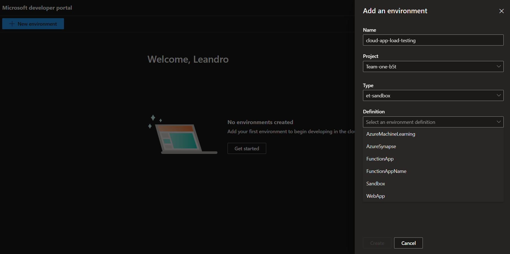

# Bicep template to bootstrap Azure Deployment Environments

Azure Deployment Environments empowers development teams to quickly and easily spin up app infrastructure with project-based templates that establish consistency and best practices while maximizing security. This on-demand access to secure environments accelerates the stages of the software development lifecycle in a compliant and cost-efficient way.

This repo uses the Azure Developer CLI to bootstrap a DevCenter resource with the minimun configuration required to start using Azure Deployment Environments.


Learn more about the [key concepts for Azure Deployment Environments](https://learn.microsoft.com/en-us/azure/deployment-environments/overview-what-is-azure-deployment-environments).

## Overview

A deployment environment is a preconfigured collection of Azure resources deployed in predefined subscriptions. Azure governance is applied to those subscriptions based on the type of environment, such as sandbox, testing, staging, or production.

With Azure Deployment Environments, your platform engineers can enforce enterprise security policies and provide a curated set of predefined infrastructure as code (IaC) templates. Your developers will use those templates to deploy environments on demand in a self-service manner.

> [!NOTE]
> Azure Deployment Environments currently supports only Azure Resource Manager (ARM) templates and Terraform (Private Preview).

This repo will deploy several Azure resources and configure DevCenter to let you start exploring Azure Deployment Environments. The following resources will be deployed:

- A resource group
- An Azure DevCenter resource
- An Azure Key Vault resource to store the GitHub token to connect to the catalog
- Sample DevCenter environment types (dev, test, prod, etc.)
- Sample DevCenter projects (Project-1, Project-2, etc.)
- Projects environment types definitions (dev, test, prod, etc.)

The projects and environments defined serve as inspiration to start using Azure Deployment Environments, you can modify the DevCenter configuration at `./infra/devcener.yaml`.

All azure resources are defined as code using Bicep, the environment definition can be found in the `infra` folder.

Let's get started!

## Pre-requisites

Make sure you have the following tools installed:

1. [Azure Developer CLI](https://learn.microsoft.com/azure/developer/azure-developer-cli/)
1. An Azure subscription with at least `Owner` RBAC role assigned to the deployment identity

## Deploy with Azure Developer CLI

### Confirm your Dev Center configuration

This template includes a deventer configuration file at `~./infra/devcenter.yaml`.
Modify the environment types, projects, catalogs and role mappings to meet your desired requirements.
Learn more about Azure Deployment environments from the [official docs](https://learn.microsoft.com/azure/deployment-environments/overview-what-is-azure-deployment-environments).

#### Catalogs

Catalogs are a set of manifests that describe the environment definitions that are able to be deployed by developers.
They include a manifest plus infrastructure as code (IaC) templates.

By default this template is pre-configured to use a default quick start catalog that does not require any authentication. When customizing using your own catalogs you will be required to setup a Github PAT token (see below).

#### Dev Center Environment Types

Dev Center Environment types that are configured at the Dev Center provide a complete list of all the environment types required within your organization.
Common examples could be `Dev`, `Test` and `Prod` but may be different in your organization.

#### Projects

Dev Center projects allow your organization to provide granular deployment configuration to dev teams and product teams within your organization.

#### Project Environment Types

Project environment types within a project specify which of the Dev Center environment types are available to each project. For example, internal project teams may not have access to deploy `Prod` environment types.

### Setup GitHub Personal Access Token (PAT)

When using a custom catalogs you will need to use a GitHub PAT for authentication.

1. Define the following environment variables which will be used to link a GitHub repository as a DevCenter catalog. A catalog is the repository that contains the environment definitions as infrastructure as code templates. Use the [Azure official repo for Azure Deployment Environments](https://github.com/microsoft/devcenter-catalog) to import sample environments definitions.

> [!NOTE]
> Before starting, create a GitHub PAT with `repo` scope to connect to a GitHub repository as a catalog. Learn more about [creating a GitHub PAT](https://docs.github.com/en/github/authenticating-to-github/keeping-your-account-and-data-secure/creating-a-personal-access-token).
>
> If the `GITHUB_TOKEN` environment variable is not set `azd` will default to the pre-configured quick start catalog.

```bash
# Bash
export GITHUB_TOKEN=<github_token>
```

PowerShell:
```PowerShell
# PowerShell
$env:GITHUB_TOKEN="<github_token>"
```

2. Run `azd up` from the root folder of this repository and follow the prompts to bootstrap your DevCenter.
3. Go to the [Developer Portal](https://devportal.microsoft.com) and start creating environments.

## Developer Experience

Once Azure Deployment Environments is deployed and configured, you can start creating environments in the Developer Portal. The following screenshot shows the Developer Portal with the sample environments and projects deployed with this repo.



Alternatively, you can deploy environments using the Azure CLI. Learn more about the [Azure Deployment Environments CLI](https://learn.microsoft.com/en-us/azure/deployment-environments/how-to-create-access-environments) or [CI/CD pipelines](https://learn.microsoft.com/en-us/azure/deployment-environments/tutorial-deploy-environments-in-cicd-github).

## Resources

- [Azure Deployment Environments Docs](https://learn.microsoft.com/en-us/azure/deployment-environments/overview-what-is-azure-deployment-environments)
- [Azure Deployment Environments GitHub repo](link_to_sample_templates_repository)
- [Microsoft Build 2023 session: Self-serve app infrastructure using Azure Deployment Environments](https://build.microsoft.com/en-US/sessions/e102bb71-f8ef-4538-9a59-158ec6f442b6?source=sessions)

## Contributing

This project welcomes contributions and suggestions. Submit a pull request with your changes!

## Issues & Feedback

If you have any feature requests, issues, or areas for improvement, please file an issue.